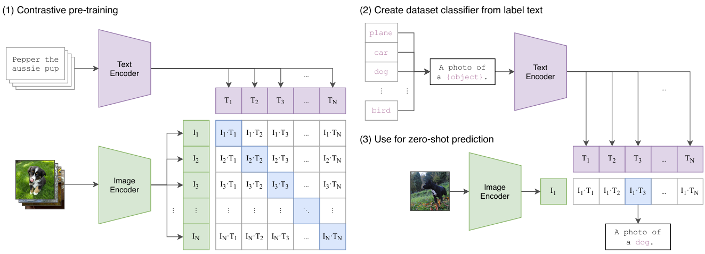

# Discussion about scientific content & value of the CLIP paper
This post explains the function and benefits of CLIP as explained in the paper "Learning Transferable Visual Models From Natural Language Supervision".

## Main idea
Traditional supervised object detectors face a significant limitation in their inability to generalize to new tasks without requiring additional labeled data. In fields like computer vision, the standard approach has been to pre-train models on large, crowd-labeled datasets such as ImageNet, which is both resource-intensive and limited in scope. This reliance on labeled data restricts the scalability and adaptability of such models to diverse real-world scenarios.

CLIP (Contrastive Language-Image Pre-training) addresses this challenge by striking a balance between learning from limited supervised "gold-labels" and leveraging the practically unlimited supervision inherent in raw text. It's developed by OpenAI and bridges the gap between text and images by learning a perception from the rich contextual information embedded in language. The main idea is to train a model to understand and relate images and text in a shared embedding space. While this concept is not entirely new, earlier attempts were hindered by the complexity of natural language. Advances in deep learning enable CLIP to achieve impressive generalization and perform a variety of tasks without requiring fine-tuning on task-specific datasets.

## Approach
CLIP adopts a straightforward yet highly effective pre-training approach by predicting which caption corresponds to a given image. This task is both scalable and efficient for learning state-of-the-art (SOTA) image representations. The training leverages a massive dataset of 400 million (image, text) pairs collected from publicly available sources on the internet, with each text consisting of a single sentence. During training, images are augmented using random square crops to the resized images. CLIP jointly trains an image encoder (a convolutional neural network) and a text encoder (a transformer) from scratch to predict the correct caption for each image (see image step 2). Unlike other methods, which attempt to predict the exact words of a caption, a challenging task due to the variability in descriptions, CLIP instead focuses on predicting the overall correspondence between an image and its paired text embedding.

To achieve this, CLIP is trained on batches of 32'768 image-text pairs. The model learns to identify the correct pairings among $N \times N$ possible pairings within the batch, using a contrastive objective to maximize the cosine similarity between the embeddings of real image-text pairs (see image step 1). This training objective allows CLIP to learn a shared multi-modal embedding space, where representations from the image and text encoders are mapped via a linear projection. Key features such as a learnable temperature parameter and clipping mechanism ensure stable training and prevent issues like excessive scaling of logits.

The result is a highly versatile model, similar to the GPT family, that generalizes across a wide range of tasks during pre-training. CLIP demonstrates capabilities such as optical character recognition (OCR), geo-localization, action recognition, and more without task-specific fine-tuning. This approach highlights the potential of natural language supervision to unlock broader functionality and adaptability in AI systems.

CLIP offers significant advantages by not only learning powerful image representations but also connecting them to language, enabling zero-shot transfer and generalization to unseen datasets and tasks. A key strength of natural language supervision lies in the large quantities of publicly available text data, which eliminates the need for manual annotations and makes it easier to scale training. However, a notable disadvantage is the requirement for extremely large minibatch size of 32'768 image-text pairs which demands substantial computational resources.

## Follow ups
CLIP is widely used for text-to-image and image-to-text retrieval, enabling powerful search and recommendation systems. It supports tasks like content moderation, visual question answering, and fine-grained recognition by understanding nuanced visual-text relationships. In creative fields, CLIP guides generative models (like DALL·E or Stable Diffusion) by aligning image generation with textual prompts.

Some examples for follow ups is for example BLIP and BLIP-2, which integrate vision-language pretraining with image captioning and question-answering tasks. Flamingo explores few-shot and multitask learning using visual-text models. CoCa (Contrastive Captioners) combines contrastive and generative learning.